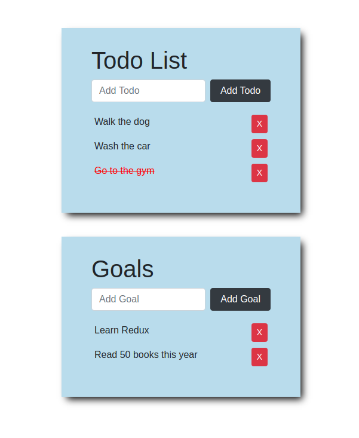

# "List of Todos and Goals" app - Udacity Learning Projects

## About Project
This mini-project is react and redux based web app part of the React Nanodegree program.
The purpose of the project is to learn how Redux works in a React-based web app.
The user will be able to add new todos and goals or to remove them from the list.

## Screenshot of the project

## Prerequisites
1). You will need Node.js and npm on your local environment to download and run this application. 
Visit https://nodejs.org to learn the specifics on downloading, installing and running Node.js. npm is packaged with Node.js.

2). You will need ReactJS on your local environment to download and run this application. 
Visit https://reactjs.org/ to learn the specifics on downloading, intalling and running ReactJS.

3). Clone the project to your local environment
### `git clone https://github.com/beasiteri/chirper-app.git`

4). Go to the cloned project
### `cd chirper-app`

5). Install dependencies
### `npm install`

6). Run the app in development mode
### `npm start`

A new browser window should automatically open displaying the app.  If it doesn't, navigate to [http://localhost:3000/](http://localhost:3000/) in your browser.
For reference, this project was bootstrapped with [Create React App](https://github.com/facebook/create-react-app).
